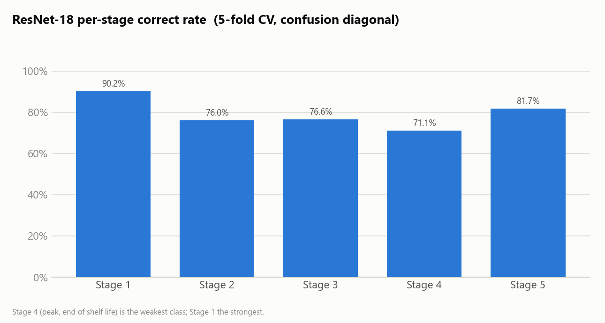
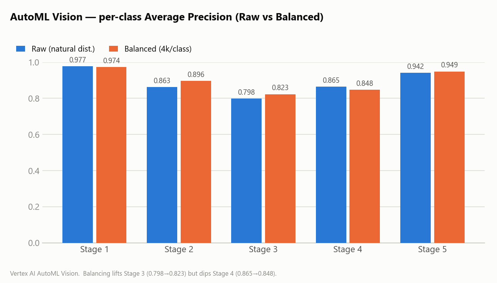
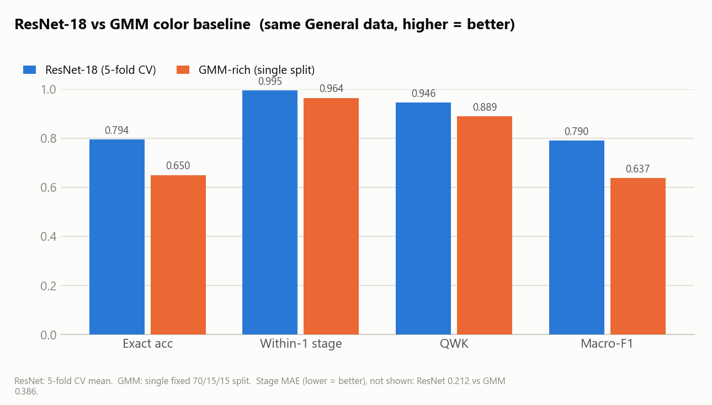

# D-avocado AI Model Summary

> Architecture and evaluation summary for avocado ripeness stage classification models.
> Charts are generated from the measured evaluation runs (`assets/model-summary/`); see the
> protocol-difference note in §1 before reading any cross-track comparison as final.

---

## 1. Evaluation Context

D-avocado has evaluated four model tracks for 5-stage avocado ripeness classification:

| Model Track | Training Setup | Evaluation Setup |
| --- | --- | --- |
| ResNet-18 Custom | PyTorch, ImageNet-pretrained | 5-fold cross-validation |
| AutoML Vision Raw | Vertex AI AutoML Vision | Single 70/15/15 train/validation/test split |
| AutoML Vision Balanced | Vertex AI AutoML Vision | Single 70/15/15 train/validation/test split |
| GMM Color Baseline | Color statistics + per-stage GaussianMixture (classical ML) | Single 70/15/15 split (same split as ResNet's fixed-split run) |

The models are **not evaluated under the same protocol yet.** ResNet-18 uses 5-fold cross-validation;
the AutoML models use a single train/test split with different dataset sizes; the GMM baseline uses the
curated single fixed split. AutoML reports precision/recall/AP at a confidence threshold, whereas
ResNet/GMM report argmax accuracy and ordinal metrics. **Direct comparison should therefore be treated
as directional rather than final** — closing this gap is the first item in §9.

---

## 2. Shared Metrics

### AutoML-focused Metrics

| Metric | Meaning |
| --- | --- |
| Precision | Share of predicted positives that are correct |
| Recall | Share of actual positives that are detected |
| Average Precision (AP) | Area under the precision-recall curve |

### ResNet / GMM-focused Metrics

| Metric | Meaning |
| --- | --- |
| Exact Accuracy | Share of images where the predicted stage exactly matches the label |
| Within-1-Stage Accuracy | Share of predictions within one ordinal ripeness stage of the label |
| QWK | Quadratic Weighted Kappa; penalizes ordinal distance between true and predicted stage |
| Macro-F1 | Average F1 score across the five stages |
| Stage MAE | Mean absolute error measured in ripeness-stage distance |

---

## 3. Model Comparison Summary

| Model | Dataset | Evaluation | Main Result | Notes |
| --- | --- | --- | --- | --- |
| ResNet-18 Custom | 13,192 images | 5-fold CV | 79.4% exact accuracy, 99.5% within-1-stage accuracy, QWK 0.946 | Strong ordinal behavior; custom deployment candidate (fold4/best.pt) |
| AutoML Vision Raw | 14,570 images | 70/15/15 split | AP 0.904, precision 82.8%, recall 78.4% | Managed baseline with natural class distribution |
| AutoML Vision Balanced | 20,000 images | 70/15/15 split | AP 0.908, precision 84.3%, recall 79.9% | Balanced to 4,000 images per class; best AutoML aggregate result |
| GMM Color Baseline | 13,192 images | 70/15/15 split | 65.0% exact accuracy, 96.4% within-1-stage, QWK 0.889 | Non-deep-learning color floor (12-D "rich" features); rgb-only variant 55.6% |

The only metric all four tracks share is **precision / recall** — plotted below. ResNet/GMM values are
macro precision/recall from argmax on the curated General test split; AutoML values are threshold-based on
its own split, so the bars are directional (§1).

---

## 4. ResNet-18 Custom Model

### 4.1 Architecture

| Item | Value |
| --- | --- |
| Framework | PyTorch |
| Backbone | ResNet-18 |
| Pretraining | ImageNet-pretrained |
| Input size | 224 x 224 |
| Deployment target | GCP Vertex AI Custom Job |

### 4.2 Training Configuration

| Hyperparameter | Value |
| --- | --- |
| Optimizer | SGD |
| Momentum | 0.9 |
| Weight decay | 0.0001 |
| Seed | 42 |
| Epochs | 30 |
| Batch size | 128 |
| Learning rate | 0.01 |
| Early stopping patience | 150 |

### 4.3 Validation Protocol

ResNet-18 uses 5-fold cross-validation.

For round `r`:

- Test fold: `fold r`
- Validation fold: `fold (r + 1) % 5`
- Training folds: the remaining three folds

The test fold is never used for model selection. Folds are split on `(Storage Group, Sample)` — never
image-level — so the same avocado never appears in both training and test (CLAUDE.md §2.1).

### 4.4 Training-only Data Processing

Augmentation is applied only to the training fold:

- Reflection
- Rotation within ±10°
- Rescale from 0.95 to 1.05
- Translation within ±10 px
- Geometric augmentation only
- No color changes

Class balancing through oversampling is also applied only to the training fold.

### 4.5 Results

Results are reported as 5-fold mean ± standard deviation over 13,192 images.

| Metric | Result |
| --- | --- |
| Exact Accuracy | 0.794 ± 0.009 (79.4%) |
| Within-1-Stage Accuracy | 0.995 ± 0.003 (99.5%) |
| QWK | 0.946 ± 0.004 |
| Macro-F1 | 0.790 ± 0.010 |
| Stage MAE | 0.212 ± 0.010 |

> **Single-split reproduction (confirmatory).** An independent fixed-split retrain
> (`P1_general_resnet18`, 15 epochs, lr 0.01 → 0.001 at epoch 10) reached **test exact accuracy 0.805,
> within-1 0.996, QWK 0.950, MAE 0.199** on the held-out test set (n = 1,962), with per-class recall
> `[0.94, 0.81, 0.75, 0.72, 0.79]` — every stage well above chance, **no single-class collapse**. This
> triangulates with the 5-fold CV mean (0.794) and the prior CPU run (0.808).

### 4.6 Fold Selection

- Fold 2 had the highest exact accuracy: `0.8071`.
- Fold 4 had the highest QWK: `0.9514`.
- `fold4/best.pt` was selected as the deployment model.

> **Deployment status.** ResNet-18 is the custom deployment *candidate*. Live serving traffic currently
> routes to the AutoML Vision endpoint (`MODEL_BACKEND=automl`) because the ResNet collapsed to
> stage-1 / confidence ≈ 1.0 on real phone photos (a light-box → phone domain gap, not an in-domain
> accuracy problem); the ResNet path is kept and reverts with `MODEL_BACKEND=resnet` (CLAUDE.md §8).

### 4.7 Confusion Matrix Diagonal

Correct-prediction rate by stage:

| Stage | Correct-prediction Rate |
| --- | --- |
| Stage 1 | 90.2% |
| Stage 2 | 76.0% |
| Stage 3 | 76.6% |
| Stage 4 | 71.1% |
| Stage 5 | 81.7% |

Stage 4 is the weakest class by diagonal accuracy, while Stage 1 is the strongest.

---

## 5. AutoML Vision Raw Model

### 5.1 Architecture

| Item | Value |
| --- | --- |
| Framework | GCP Vertex AI AutoML Vision |
| Training mode | Managed training |
| Class distribution | Natural distribution |

### 5.2 Dataset

| Split | Images |
| --- | ---: |
| Train | 10,200 |
| Validation | 2,185 |
| Test | 2,185 |
| Total | 14,570 |

Split ratio: 70/15/15.

### 5.3 Results

| Metric | Result |
| --- | --- |
| Average Precision (AP) | 0.904 |
| Precision | 82.8% |
| Recall | 78.4% |

### 5.4 Per-class AP

| Stage | AP |
| --- | ---: |
| Stage 1 | 0.977 |
| Stage 2 | 0.863 |
| Stage 3 | 0.798 |
| Stage 4 | 0.865 |
| Stage 5 | 0.942 |

Stage 3 is the weakest class by AP in the raw AutoML model.

---

## 6. AutoML Vision Balanced Model

### 6.1 Architecture

| Item | Value |
| --- | --- |
| Framework | GCP Vertex AI AutoML Vision |
| Training mode | Managed training |
| Class distribution | Balanced, 4,000 images per class |

### 6.2 Dataset

| Split | Images |
| --- | ---: |
| Train | 14,000 |
| Validation | 3,000 |
| Test | 3,000 |
| Total | 20,000 |

Split ratio: 70/15/15.

### 6.3 Results

| Metric | Result |
| --- | --- |
| Average Precision (AP) | 0.908 |
| Precision | 84.3% |
| Recall | 79.9% |

### 6.4 Per-class AP

| Stage | AP |
| --- | ---: |
| Stage 1 | 0.974 |
| Stage 2 | 0.896 |
| Stage 3 | 0.823 |
| Stage 4 | 0.848 |
| Stage 5 | 0.949 |

Balancing improves aggregate AP, precision, recall, and Stage 3 AP compared with the raw AutoML model,
while Stage 4 AP decreases slightly.

---

## 7. GMM Color Baseline

A non-deep-learning comparison point (`src/gmm_baseline.py`): each image is reduced to the mean color
statistics of its non-white (avocado) pixels, one `GaussianMixture` is fit per ripeness stage on the
training split, and an image is classified by maximum posterior. It shares the **same curated manifest,
split, and metrics** as the ResNet fixed-split run, so it is directly comparable to that run and serves as
the "how much can color alone do?" floor.

### 7.1 Feature Sets

| Variant | Features | Dimensions |
| --- | --- | ---: |
| rgb | mean R, G, B | 3 |
| rich | + std R/G/B, mean H/S/V, mean L/a/b | 12 |

### 7.2 Results (single 70/15/15 split, n = 1,962)

| Metric | rgb | rich |
| --- | ---: | ---: |
| Exact Accuracy | 0.556 | **0.650** |
| Within-1-Stage Accuracy | 0.932 | 0.964 |
| QWK | 0.843 | 0.889 |
| Macro-F1 | 0.535 | 0.637 |
| Stage MAE | 0.518 | 0.386 |

### 7.3 Interpretation

Color statistics alone already get the **ordinal ranking** mostly right (rich QWK 0.889, within-1 96.4%),
but cannot resolve the exact adjacent-stage boundaries that the CNN separates — GMM-rich trails ResNet-18
by roughly 14 points on exact accuracy (65.0% vs 79.4%) and on Macro-F1. This is the value deep features add.

---

## 8. Key Takeaways

- ResNet-18 is the current custom deployment candidate because it has stronger control over training,
  validation, checkpoint selection, and future MLOps.
- AutoML Balanced performs slightly better than AutoML Raw on aggregate AP, precision, and recall.
- ResNet-18 shows very high within-1-stage accuracy, which is important because ripeness stages are ordinal.
- The GMM color baseline (65.0% exact) shows color statistics capture most of the ordinal signal
  (QWK 0.889) but trail ResNet by ~14 points on exact accuracy — deep features are needed to resolve
  adjacent-stage boundaries.
- Exact accuracy remains the main operational target because QWK can look overly optimistic for near-miss
  predictions.
- Stage 4 remains an important risk area in the ResNet confusion matrix.
- Stage 3 and Stage 4 are the most important classes to monitor closely across future evaluation runs.

---

## 9. Open Evaluation Gaps

- Align model evaluation protocols so ResNet-18, AutoML, and the GMM baseline are compared under the same
  split or cross-validation setup (currently 5-fold CV vs single split vs different dataset sizes).
- Report per-class precision, recall, and F1 for ResNet-18 under cross-validation (single-split values exist).
- Report full confusion matrices for all model tracks.
- Evaluate real-world phone images, not only studio-style dataset images (the domain gap that currently
  routes live traffic to AutoML).
- Track performance after inference-time background segmentation.
- Decide whether final model selection should prioritize exact accuracy, Macro-F1, QWK, or deployment
  constraints.

---

*Charts regenerated by `scripts/make_model_summary_charts.py` (dataviz palette; blue/orange CVD-validated).
Numbers sourced from the measured evaluation runs in `gs://qi-2026summer-avocado/outputs/` and the AutoML
Vision evaluation console.*
