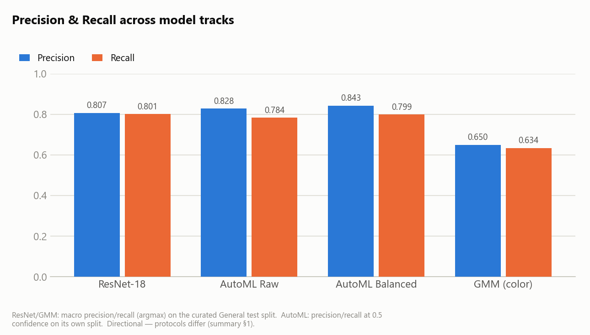

# Avocado Ripeness — Paper Reproduction + Production Serving

**5-stage ripeness classification** of avocados from a single RGB photo + **days-to-target shelf-life estimation**.
Reproduces the published method of Xavier et al. (Foods 2024, DOI 10.3390/foods13081150) as a training
baseline, then goes beyond it: a curated-data retrain, a classical-ML (GMM) comparison baseline, group-aware
k-fold cross-validation, and a live FastAPI prediction service on Cloud Run behind the Spring backend
(`davocado-server`).

**Current stage: training + serving.** For pitfalls, data-leakage rules, dataset facts, and the full serving
contract, **[`CLAUDE.md`](CLAUDE.md) is the canonical operating manual** — read it before changing data
handling, splits, or the serving contract. This README is a project/quickstart overview.

Data: Hass Avocado Ripening Photographic Dataset, Mendeley DOI 10.17632/3xd9n945v8.1 (CC BY 4.0).

> ⚠️ The classifier input is **a single RGB image only**. Metadata such as Storage Group, Day, Sample, view,
> days_left, and color statistics are not fed to the model (CLAUDE.md §2.3). Storage group / Sample / view /
> Day are used only for filtering, sample-level split, two-side aggregation, and choosing the shelf-life formula.

## Installation
```bash
pip install -r requirements.txt
# GPU (CUDA) torch instead of the CPU wheel:
pip install torch==2.6.0 torchvision==0.21.0 --index-url https://download.pytorch.org/whl/cu124
```
Data: `data/Avocado Ripening Dataset.xlsx` (committed) + download the images via DOI to
`data/Hass Avocado Ripening Photographic Dataset/.../Avocado Ripening Dataset/*.jpg`.

### Curated training manifest (CLAUDE.md §2.6)
Training uses a **curated subset**: only the 392 (of 478) samples with a complete 1→5 ripening trajectory —
`data/avocado_complete_states.csv` (also mirrored to `gs://qi-2026summer-avocado/data/`). This is enforced in
one place, `data.filter_to_manifest()`, applied when `validate_data.py` builds `metadata_clean.csv`; every
downstream step (`split.py`, `dataset.py`, the GMM baseline, k-fold CV) inherits it automatically. To train on
the full 478-sample dataset instead, delete the manifest file or unset `AVOCADO_MANIFEST`.

## Reproduction steps

```bash
# 1) Data integrity checks → metadata_clean.csv (applies the curated manifest)
python -m src.validate_data                 # (--skip-image-check to skip the corruption check)

# 2) Sample-level 70/15/15 split → splits.csv (shared by all models, leakage-verification assert)
python -m src.split --seed 42

# 3) Pipeline check (smoke)
python -m src.train --config configs/paper/general_resnet18.yaml --smoke-test

# 4) Individual training (e.g., General × ResNet-18). --val-freq is a practical override
python -m src.train --config configs/paper/general_resnet18.yaml --val-freq 80

# 5) Train + evaluate all 8 experiments
python scripts/run_paper_experiments.py

# 6) Evaluation only (against trained checkpoints)
python -m src.evaluate --all
python -m src.evaluate --config configs/paper/general_resnet18.yaml

# 7) Group-aware k-fold cross-validation (resumable — see "K-fold CV" below)
python -m src.cv_train --config configs/paper/general_resnet18.yaml --folds 5

# 8) Classical-ML color baseline for comparison (see "GMM baseline" below)
python -m src.gmm_baseline --dataset general --components 2

# 9) Pipeline tests
python tests/test_pipeline.py
```

## 8 experiments (5-stage, paper reproduction)
`configs/paper/*.yaml` — {general, T10, T20, Tamb} × {ResNet-18, AlexNet}.
experiment_id: `P1_general_resnet18_...` through `P8_tamb_alexnet_...`.
Deployed to production: **P1 (general × ResNet-18)**, though `MODEL_BACKEND=automl` currently
routes live traffic to a teammate's AutoML model instead (see Serving below).

## Model comparison (ResNet vs AutoML vs GMM)
Full write-up — per-model architecture, training configs, per-class charts, and open evaluation gaps:
**[`MODEL_SUMMARY.md`](MODEL_SUMMARY.md)** (charts regenerate via `scripts/make_model_summary_charts.py`).

Headline: **ResNet-18** 5-fold CV **79.4% exact / 99.5% within-1 / QWK 0.946**; **AutoML Balanced** AP 0.908
(precision 84.3% / recall 79.9%); **GMM-rich** color baseline 65.0% exact. The four tracks share only
precision/recall, and their protocols differ (5-fold CV vs single split vs threshold-based AutoML), so read
the cross-track bars as **directional, not final** (see MODEL_SUMMARY §1).



## GMM color baseline (classical ML comparison)
`src/gmm_baseline.py` — a non-deep-learning comparison point: each image → mean color stats of the avocado
(non-white) pixels (`"rgb"` = 3-D mean RGB, `"rich"` = +std/HSV/Lab, 12-D); one `GaussianMixture` per ripeness
stage fit on train; classify by max posterior. Same split/manifest/metrics as ResNet, so results are directly
comparable. On curated-392 `general`: **rgb 0.556 / rich 0.650 exact accuracy** vs **ResNet-18 ≈0.81** —
color alone gets ordinal ranking mostly right (QWK 0.84–0.89 vs ResNet's 0.95) but can't resolve exact
adjacent-stage boundaries the way the CNN does. Emits an RGB/Lab scatter PNG and a per-image feature CSV.

## K-fold cross-validation
`src/cv_train.py` — group-aware k-fold (split on `(Storage Group, Sample)`, never image-level, CLAUDE.md §2.1)
for a more robust accuracy estimate than the single fixed split. **Resumable**: each fold's result is cached
to `cv/<exp>/fold<f>.json`, so an interrupted run (folds take hours on CPU) picks up where it left off instead
of restarting; `--recover-folds "0,1"` re-evaluates an existing `best.pt` for those folds instead of retraining.

## Output file structure
```
outputs/paper_reproduction/
├── splits/         metadata_clean.csv, splits.csv
├── checkpoints/    <experiment_id>/best.pt, config.json, history.json
├── predictions/    <experiment_id>_test_predictions.csv, _test_observations.csv
├── metrics/        <experiment_id>_metrics.json  (A image / B best-side / C two-side / shelf-life)
├── confusion_matrices/  <experiment_id>_confusion.json
├── gmm_baseline/   gmm_<dataset>_k<k>_{rgb,rich,compare}.json, _features.csv, _{rgb,lab}_scatter.png
├── cv/<exp>/       fold<f>.json, cv_<dataset>_<k>fold.json  (mean±std across folds)
├── logs/
└── reports/        data_validation.json, paper_reproduction_report.md
```
Checkpoints (*.pt) and images are excluded from commits via .gitignore.

## Code structure (src/)
`data.py` (metadata loading, `filter_to_manifest`) · `validate_data.py` (integrity → metadata_clean.csv) ·
`split.py` (sample-level split) · `transforms.py` (paper/eval/noaug) · `sampler.py` (random oversampling) ·
`dataset.py` (image Dataset) · `models.py` (ResNet-18/AlexNet) · `train.py` (config-driven training, single
split or injected fold frames) · `cv_train.py` (resumable group-aware k-fold) · `evaluate.py` (image/best-side/
two-side) · `gmm_baseline.py` (classical-ML color comparison) · `preprocess.py` (inference-only real-photo
background-removal crop — see Serving) · `shelf_life.py` (shelf-life α formulas, paper + serving) · `predict.py`
(CLI inference) · `metrics.py` · `utils.py`.

## Serving (production)
`serving/` — a FastAPI prediction container on **Cloud Run** (`avocado-serving`, GCP project `qi-2026summer`,
`us-central1`), called by the Spring backend (`davocado-server`). Full wire contract:
**[`CLAUDE.md` §8](CLAUDE.md)** (invariants) and `docs/serving-contract.md` (git-ignored, forward to the
backend team directly).

**Current live configuration:**
- `MODEL_BACKEND=automl` — routes to a teammate's cross-project Vertex AI AutoML Endpoint (project
  `qiautoml1`) rather than the local ResNet, because the local ResNet was observed collapsing to
  stage-1/confidence≈1.0 on real phone photos (domain-gap failure vs. the light-box training data). The
  ResNet checkpoint/code path is kept, not deleted — `MODEL_BACKEND=resnet` reverts with no code change.
- `ENABLE_CROP=1`, `SEGMENTER=inspyrenet` (`src/preprocess.py`) — real photos are background-removal
  cropped before classification (closes the CLAUDE.md §3 domain gap) and the crop is returned to the backend
  as `cropped_b64` (method A) for it to store. `SEGMENTER=rembg` is a faster/lighter fallback (~1-3s/image
  vs. InSPyReNet's ~50s+); `sam3` is a future GPU-only option.
- **Deploy requires `--memory=8Gi --cpu=2`** (InSPyReNet OOMs at Cloud Run's 4Gi default) — this is a
  deploy-time flag only, not captured in any config file here; don't lose it on a fresh redeploy.
- `requirements-preprocess.txt` pins `opencv-python-headless==4.10.0.84` — do not let this float to latest
  (5.0.0.93 ships a broken wheel that crash-loops the container on startup).

Build/deploy: `serving/Dockerfile` (`gcloud builds submit -f serving/Dockerfile`, then `gcloud run deploy`).
Training-side GCP scripts: `scripts/01_setup_gcp.sh` … `04_submit_job.sh` (Vertex AI custom training jobs).

## Preserving the existing baseline
The no-augmentation General ResNet-18 baseline (**B0**, single-image val acc 0.783) must not be deleted or
overwritten. Preserve the checkpoint `checkpoints/resnet18_baseline.pt`; results are in `docs/modeling-plan.md`.

For detailed reproduced items / undisclosed items / results, see
**[`docs/paper_reproduction_report.md`](docs/paper_reproduction_report.md)** and
**[`docs/gcp-resnet18-results.md`](docs/gcp-resnet18-results.md)** (running the pipeline also regenerates an
updated copy of the former under `outputs/paper_reproduction/reports/`).
